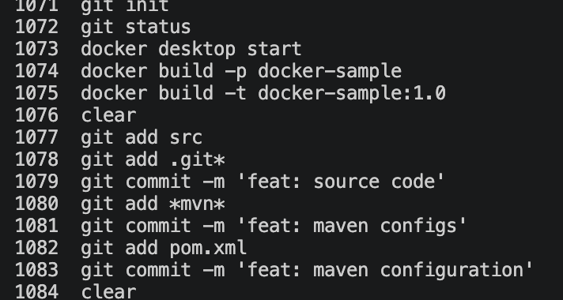
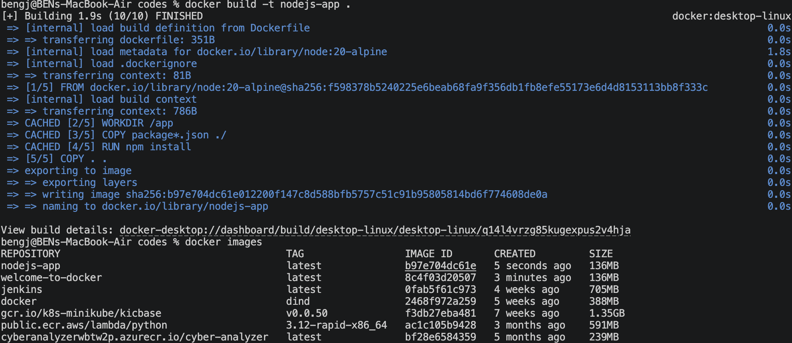
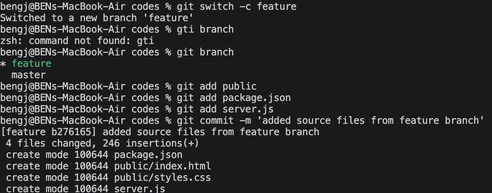
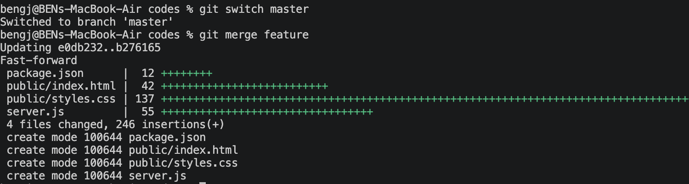
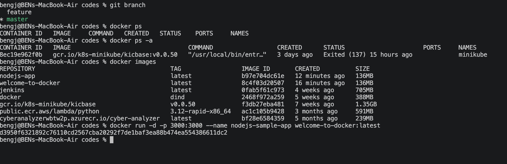
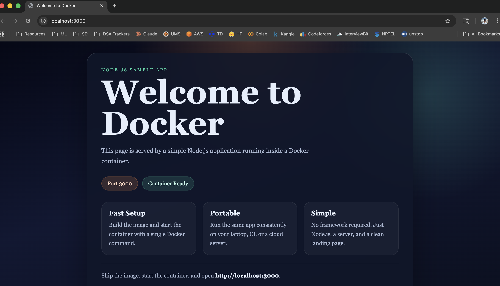

# Docker - Git Workflow

In this project we will be using Docker to containerize a node.js sample application. We will also be using Git for version control and collaboration.

**Project done by: Ben Gregory John**
**Registration Number: 12315900**
**Roll no: 04**

---

## Dockerfile

```Dockerfile
# A sample node.js Dockerfile that'll showcase a web page

# Base image
FROM node:20-alpine

# Create app directory
WORKDIR /app

# Install app dependencies
COPY package*.json ./

RUN npm install

# Bundle app source

COPY . .

# Expose the port the app runs on
EXPOSE 3000

# Start the app
CMD ["npm", "start"]
```

---

## Workflow

### 1.Git Repository creation and Dockerfile setup
I've initialized a Git repository and created a Dockerfile for the node.js application.
As per the question, accidential commit of the source code was done in the `master` branch.




### 2. Docker Image Build
I've build the docker image using the command `docker build -t nodejs-app`.




### 3. Creating feature branch
Now I've created a new branch called `feature` to add the source code and commit the changes.




### 4. Merging feature branch to master
After committing the changes in the `feature` branch, I've merged it back to the `master` branch.



### 5. Running the Docker container
Finally, I've run the Docker container using the command `docker run -p 3000:3000 nodejs-app` to see the application in action.



### 6. Running instance



---

